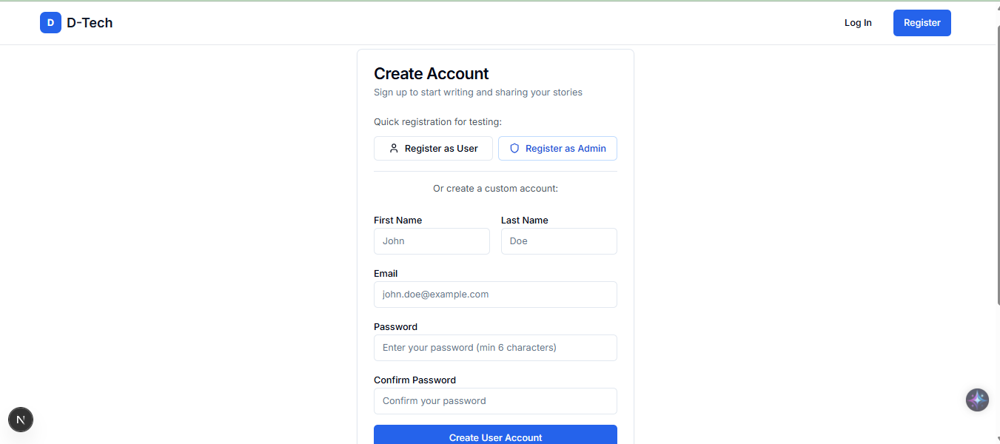
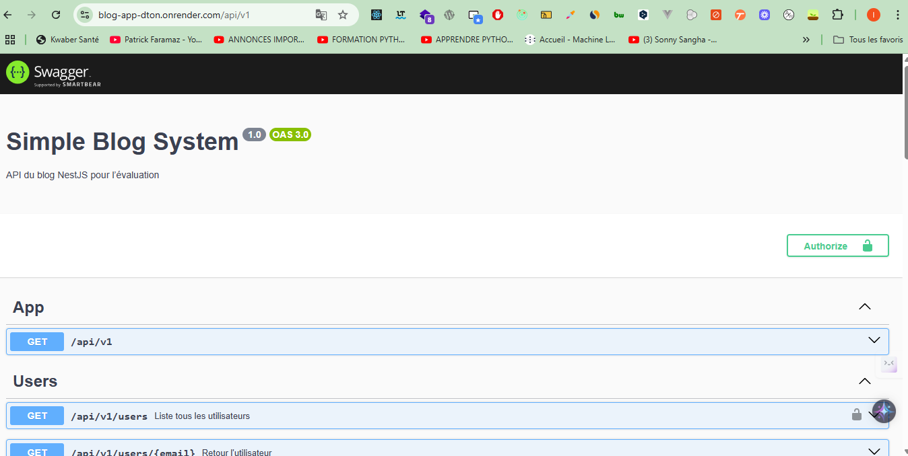
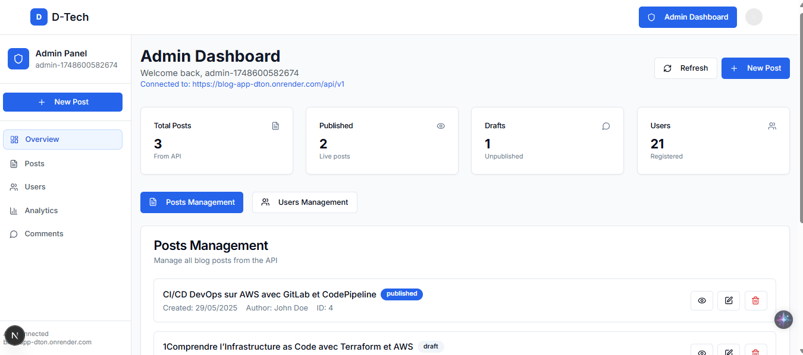

# 📝 Blog App – Fullstack Web Project

Application de blog moderne réalisée avec **NestJS** (backend) et **Next.js 15** (frontend), dans le cadre de l’évaluation technique pour Akieni.

---

## 🌐 Démo en ligne

- 🔗 [Application Frontend (Vercel)](https://dev-app-mocha.vercel.app/) 
- 🔗 [Documentation API (Swagger – Render)](https://blog-app-dton.onrender.com/api/v1)

> ⚠️ **Note** : Le backend est hébergé sur Render. En cas d’inactivité prolongée, le serveur peut se mettre en veille, entraînant un court délai au démarrage de la première requête.

---
## 🧪 Comptes de démonstration

### 👤 Utilisateur standard

- **Email** : `user@example.com`  
- **Mot de passe** : `user123`

### 🛡️ Administrateur
- **Url**: https://dev-app-mocha.vercel.app/dashboard

- **Email** : `admin@example.com`  
- **Mot de passe** : `admin123`

## 👁️ Aperçu visuel

### Frontend (Next.js)


*Interface de connexion utilisateur*

### Backend (Swagger & Interface Admin)


*Documentation Swagger sécurisée*


*Interface de création d'article (admin uniquement)*

---

## 🧱 Stack Technique

### Backend
- 🚀 **NestJS**, **PostgreSQL**, **TypeORM**
- 🔐 Authentification JWT avec rôles (`admin`, `user`)
- 📘 Documentation Swagger

### Frontend
- ⚡ **Next.js 15** (App Router, Server Components)
- 🎨 UI responsive avec **Tailwind CSS**
- 🔒 Gestion JWT côté client

---

## ✨ Fonctionnalités

### Accès public
- 📰 Affichage de la liste des articles
- 📖 Consultation des détails d’un article
- 💬 Visualisation des commentaires

### Accès authentifié
- 🔐 Inscription / Connexion via JWT
- ✍️ Ajout de commentaires (utilisateurs connectés uniquement)
- 🛠️ Création/modification d’articles (réservé aux admins)

---

## ⚙️ Installation locale

### 1. Cloner le projet

```bash
git clone https://github.com/mboulombre/blog-app.git
cd blog-app
cp .env.dist .env
docker compose up -d
